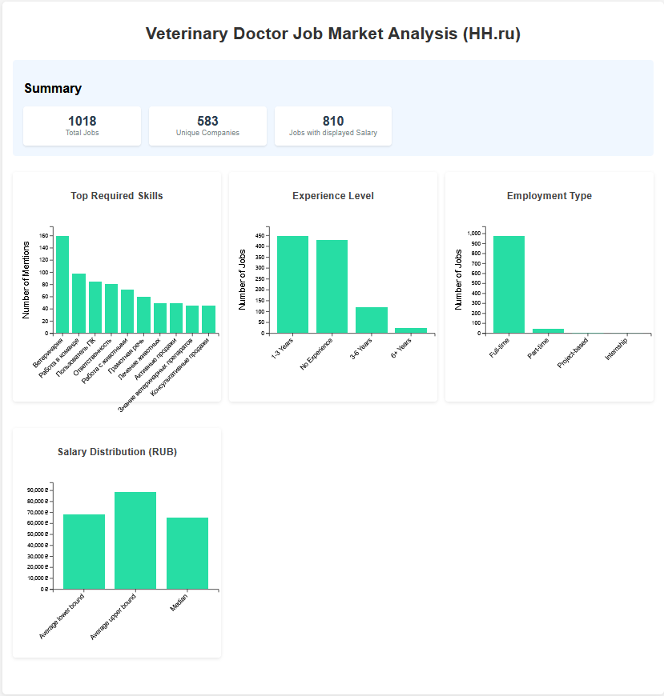

# Simple stats dashboard for a job market of your choice

## Example: veterinary doctor



You may find the JSON with the prepared dataset [here](https://drive.google.com/file/d/1tp-HnJC1qjSWepOZhvCxwko0gVP-ZX6N/view?usp=sharing).

## How to scrape a dataset

1. Paste your query with a job name to `scraper.py`:
```
params={
    'text': 'PROFESSION_NAME', # PASTE YOUR QUERY
    'page': page,
    'per_page': per_page
}
```

2. Run in terminal (this may take some time):
```
pip install -r requirements.txt
python scraper.py
```

3. As a result, you will get a CSV file (or multiple - if you run the scraper for different queries). Then you need to preprocess it and compose to a JSON. For that, you may use `data_preproc.ipynb` as is, or adjusted for your specific purposes.

## How to see the dashboard

4. Put resulting `output.json` to the same folder where `index.html` is located and run `python -m http.server -8000` in a terminal for the same directory.

5. Open the link displayed in the terminal - e.g., `http://[::]:57536/`
